# Antigravity Strict Engineering Kernel (V1.2.4)

A deterministic, risk-adaptive, reality-hardened, and adversarial reliability kernel for Google Antigravity on Windows.

[](https://github.com/WinierKingYT/antigravityflash/actions/workflows/ci.yml)
[](pyproject.toml)
[](run_tests.py)
[](LICENSE)

---

## 🛡️ Overview

The **Strict Engineering Kernel** eliminates common AI coding assistant failure modes: premature coding, silent requirement omissions, false-positive test passes, host environment contamination, unverified claims, and reality gaps between reported pass and real project execution.

### Central System Invariant
```text
NO REAL EXECUTION != PASS
NO REAL DEPENDENCY RESTORE → NO DEPENDENCY PASS
NO REAL BUILD EXECUTION    → NO BUILD PASS
NO REAL TEST EXECUTION     → NO TEST PASS
NO REAL RUNTIME STARTUP    → NO RUNTIME PASS
REAL EXECUTION EVIDENCE > DETERMINISTIC STATIC EVIDENCE > VERIFIER ANALYSIS > BUILDER CLAIM
```

It operates through deep Antigravity lifecycle hooks (`PreInvocation`, `PreToolUse`, `Stop`) to enforce strict engineering invariants across every software development lifecycle step.

---

## 🚀 Architectural Layers

```mermaid
flowchart TD
    Req[User Request Intent] --> Frame[Intent Extraction & Framing]
    Frame --> Discovery{Material Ambiguity?}
    Discovery -- Explicit --> ReqDirect[Direct Intent Compilation]
    Discovery -- Ambiguous --> SemanticDisc[Semantic Discovery Protocol Schema 7.2]
    SemanticDisc --> UserDec[User Decision Recording]
    UserDec --> ReqGen[Decision-Traceable Requirements]
    ReqDirect --> TestOracle[Test Oracle: Given-When-Then Contracts]
    ReqGen --> TestOracle
    TestOracle --> SpecLock[Spec Phase & Coverage Audit Lock]
    SpecLock --> RiskEng[Risk Engine: 10-Dimension Risk Scoring]
    RiskEng --> SandBox[Git Worktree Isolated Sandbox]

    subgraph AdvEngines [Adversarial Verification Suite]
        Prop[Bounded Property Testing]
        Fuzz[Boundary Fuzzing Engine]
        Mut[Syntactic Mutation Testing]
        Fault[Real Disposable Failure Injection]
    end

    SandBox --> AdvEngines

    subgraph CleanEnvFactory [Clean Environment & Reality Hardening]
        FreshEnv[Scratch Environment Reconstruction]
        ZeroCache[Zero-Cache Frozen Restoration]
        DBVerify[DB Bootstrap & Migration Reversibility]
        Smoke[Runtime Startup & Crash Detection]
        DoubleBuild[Run A vs Run B Bit-for-Bit Double Build]
        ExecModel[Canonical Execution Evidence Model]
    end

    AdvEngines --> CleanEnvFactory

    subgraph Step6S [Single-Model Blind Verification Gate]
        BlindAudit[Blind Final Verifier - Clean Room Context]
        CXAudit[Counterexample Auditor - Anchoring Defense]
        HiddenChecks[Hidden Verification Suite & Check Promoter]
        ContextIso[Runtime Context Proof & Isolation Defense]
        TrustedHook[Trusted Lifecycle Hook Origin & Context Binding]
    end

    CleanEnvFactory --> Step6S
    Step6S --> Promotion[Verified Candidate Promotion to Canonical]
    Promotion --> PostPromo[Post-Promotion Diff Equivalence & Regression Check]
    PostPromo --> StaleAudit[Dynamic Stale Invalidation Check]
    StaleAudit --> StopGate[Stop Completion Gate]
```



### Complete Layer Architecture:
1. **Layer 1 (V4 Baseline):** Phase isolation (`SPECIFICATION` vs `IMPLEMENTATION`), 100% semantic requirement coverage, tamper-evident SHA-256 cryptographic evidence hash chain, and baseline regression delta detection.
2. **Layer 2 (V4.1 Adversarial Hardening):** 7 protected critical harness artifacts, multi-replace tool interception, shell command write-vector inspection (`Set-Content`, `Out-File`, cmd `>`, Python `open().write()`), and single-writer state machines.
3. **Layer 3 (Step 2 Git Worktree Sandbox):** Disposable git worktrees (`.git/worktrees/agent-sandbox-*`), isolated candidate development, diff equivalence validation, and non-overlapping dirty workspace preservation.
4. **Layer 4 (Step 3 Risk Engine & Policy Compiler):** 10-dimension requirement risk scoring (`LOW`, `MEDIUM`, `HIGH`, `CRITICAL`), deterministic verification policy compilation, and dynamic risk escalation on defect discovery.
5. **Layer 5 (Step 4 Test Quality & Adversarial Verification):** Bounded property testing, boundary fuzz testing, syntactic mutation testing (operator/boundary/statement mutation), disposable fault injection, and zero surviving mutants on critical paths.
6. **Layer 6 (Step 5 Clean Environment & Reproducible Build Factory):** Non-blocking container probing, zero-cache scratch source reconstruction (excluding `node_modules`, `venv`, `dist`, `.env`), frozen lockfile enforcement, database migration rollback verification, runtime smoke tests, and double-build bit-for-bit SHA-256 reproducibility verification.
7. **Layer 7 (Step 5.1 Reality Gap Hardening & Atomic Packaging):**
   - **Canonical Execution Evidence Model (`ExecutionRecord`):** 9 execution types, 7 origins (`REAL_PROJECT_EXECUTION`, `LIVE_KERNEL_EXECUTION`, `SIMULATED_INTEGRATION`, `KERNEL_UNIT_TEST`, `MOCK`, `MODEL_CLAIM`, `USER_ACCEPTANCE`), scrubbed env/secrets, exit codes, durations, and artifact hashes.
   - **Subprocess Discovery & Verification:** Dependency restore (`npm ci` / `pip install -r`), scratch build execution, real test execution, startup crash detection (`STARTUP_CRASH`), smoke journey testing (`JOURNEY_FAILED`), and SQLite migration verification.
   - **Non-Destructive Atomic Installer:** Managed block `<!-- STRICT_ENGINEERING_KERNEL_START -->` in `GEMINI.md`, JSON-aware merging in `hooks.json`, single backslash escaping, and automated backup/rollback.
8. **Layer 8 (Step 6S/6S.1 Blind Verification, Context Isolation & Trusted Hook Origin):**
   - **Context Isolation Proofs:** Verifier evaluates code with zero access to builder transcripts or self-reported claims. Fresh conversation context and registry tracking verify clean-room execution contexts.
   - **Trusted Hook Origin & Threat Model:** Runtime context and hook-origin checks are enforced via Antigravity runtime metadata, context expectations, provenance validation, and deterministic state gates. (Note: These checks are runtime and state-bound; they do NOT constitute cryptographically authenticated platform-origin proof unless the underlying platform supplies unforgeable cryptographic signatures. Same-user hostile process resistance remains outside the hard guarantee).
   - **Truth Hierarchy:** `REAL EXECUTION EVIDENCE > DETERMINISTIC STATIC EVIDENCE > VERIFIER ANALYSIS > BUILDER CLAIM`.
9. **Layer 9 (Step 7 / 7.1 / V1 Decision Intelligence & Semantic Discovery):**
   - **Semantic Discovery Protocol (Schema 7.2):** High-impact product & architecture decisions discovered semantically. Heuristic seeds marked strictly advisory; zero premature implementation.
   - **User Authority Invariant:** Agent presents high-contrast behavioral tradeoffs; user makes binding decisions. Agent never substitutes technology choices for product behavior.
   - **Test Oracle Semantic Acceptance Contracts:** Behavioral Given-When-Then contracts locked with strict token overlap and schema compliance before implementation begins.
   - **Fingerprint V2 & Stale Propagation:** Cryptographic contract fingerprints bind authority and acceptance criteria. Altering decisions or contracts automatically invalidates derived requirements from `PASS` to `STALE`.

---

## 🐶 V1 Real-Project Dogfood Evidence

The kernel has been proven across 4 distinct real-world executable software projects and 5 torture scenarios:

| Project | Domain | Key Invariants Verified | Seeded Defect Caught | Stale Propagation | Verdict |
|---|---|---|---|---|---|
| **DOGFOOD-A** (`hashmanifest`) | Explicit Small CLI | Zero-decision direct intent compilation, scratch venv test, CLI runtime smoke. | N/A | Verified Invariant | **COMPLETE** |
| **DOGFOOD-B** (`memokeeper`) | Ambiguous Local App | Heuristic seed blocking, semantic concern ingestion, question utility thresholding (1 asked, 3 avoided). | N/A | Verified Invariant | **COMPLETE** |
| **DOGFOOD-C** (`docvault`) | Authorization Service | CRITICAL ambiguity detection, negative auth criteria locking, builder self-cert blocked, defect injection caught. | Unauthorized deletion bug caught & blocked | Verified Invariant | **COMPLETE** |
| **DOGFOOD-D** (`taskjournal`) | State & Recovery | Worktree isolation over dirty workspace (`user_notes.txt` preserved intact), defect injection caught, decision alteration. | State loss truncation bug caught & blocked | PASS -> STALE verified | **VERIFIED_STALE_PROPAGATION** |

Detailed reports available in [`docs/release/v1/`](docs/release/v1/).

---

## 📂 Project Structure

```text
antigravity-strict-engineering-kernel/
├── agents/                             # Packaged Antigravity Subagents
│   ├── builder/agent.md               # Execution-bounded builder agent
│   ├── counterexample-auditor/agent.md # Adversarial falsification auditor
│   ├── diagnostic-engineer/agent.md    # Root cause analysis engineer
│   ├── engineering-orchestrator/agent.md # Lifecycle master orchestrator
│   ├── final-verifier/agent.md         # Clean-room verifier
│   ├── scope-auditor/agent.md          # 100% requirement coverage auditor
│   ├── spec-architect/agent.md         # Atomic specification architect
│   └── test-oracle/agent.md            # Acceptance criteria & contract locking
├── src/strict_engineering/             # Canonical Kernel Source Modules
│   ├── __init__.py                    # Version 1.2.4
│   ├── acceptance_protocol.py         # Test Oracle Given-When-Then acceptance locking
│   ├── adversarial_verification.py    # Property, fuzz, mutation & fault injection
│   ├── baseline.py                    # Workspace health baseline & regression delta
│   ├── blind_verifier.py              # Single-model blind verification engine
│   ├── cli.py                         # Unified strict-engineering CLI & UX entrypoint
│   ├── concern.py                     # Schema 7.2 Semantic concern model & risk scoring
│   ├── consistency_reviewer.py        # Global decision consistency auditor
│   ├── context_registry.py            # Step 6S.1 Context isolation proof registry
│   ├── counterexample_auditor.py      # Adversarial counterexample auditor
│   ├── decision.py                    # Architectural decision ledger & supersession
│   ├── decision_coverage.py           # 4-tier traceability matrix (Intent->Concern->Decision->Req)
│   ├── decision_engine.py             # Unified Decision Intelligence facade
│   ├── decision_events.py             # Append-only cryptographic decision event ledger
│   ├── decision_graph.py              # Directed acyclic decision dependency graph
│   ├── disagreement.py                # Multi-model verdict consensus & disagreement analyzer
│   ├── discovery_protocol.py          # Machine-visible semantic discovery protocol (Schema 7.2)
│   ├── distribution.py                # Manifest, transactional update & non-destructive uninstall
│   ├── environment_detector.py        # Container, ecosystem & lockfile inspector
│   ├── environment_factory.py         # Clean scratch environment factory & subprocess runner
│   ├── evidence_resolution.py         # Multi-model evidence reconciliation gate
│   ├── fingerprint.py                 # SHA-256 workspace & contract hashing
│   ├── frame.py                       # User intent extraction & canonical framing
│   ├── gate.py                        # Stop gate & PreToolUse security matrix
│   ├── hidden_verification.py         # Hidden verification suite & check promoter
│   ├── hooks_handler.py               # Antigravity CLI lifecycle hook dispatcher
│   ├── independent_model.py           # Independent clean-room verification harness
│   ├── installer.py                   # Atomic installer & configuration manager
│   ├── interaction_policy.py          # ASK / SUGGEST / CHALLENGE / PROCEED policy
│   ├── kernel.py                      # State machine, evidence chain & stale invalidator
│   ├── observability.py               # Privacy-safe bounded event logging & latency telemetry
│   ├── question_utility.py            # Value-of-information question filter
│   ├── reporting.py                   # Multi-schema canonical report generator
│   ├── reproducibility.py             # Double-build SHA-256 bit-for-bit comparator
│   ├── requirement_generator.py       # Atomic requirement compilation & contract fingerprints
│   ├── risk_engine.py                 # Multi-factor requirement risk scoring
│   ├── runtime_safety.py              # Bounded continue circuit breaker, termination normalization & runtime safety
│   ├── sandbox.py                     # Git worktree sandbox manager & promotion
│   ├── stopping_engine.py             # Stopping conditions & gate synchronization
│   └── verification_policy.py         # Dynamic policy compiler
├── tests/                             # Comprehensive Test Suites
├── scripts/
│   ├── install.py                     # Python-native atomic installer
│   ├── install.ps1                    # PowerShell atomic installer
│   └── run_all_tests.py               # Complete test suite runner
├── docs/release/v1/                   # Official V1 Release Documentation & Evidence
├── .github/workflows/ci.yml           # GitHub Actions CI workflow
├── GEMINI.md                          # Antigravity strict engineering rules
├── hooks.json                         # Antigravity lifecycle hooks configuration
├── pyproject.toml                     # Package specification (v1.2.4)
└── run_tests.py                       # Top-level test runner
```

> [!NOTE]
> **Packaging & Compatibility Status**: Official Antigravity plugin packaging is deferred / not currently claimed. The kernel installs and integrates directly via Antigravity lifecycle hooks (`~/.gemini/config/hooks.json`), core agent prompts (`~/.gemini/config/agents/`), and instructions (`~/.gemini/GEMINI.md`).

---

## ⚡ Installation & Quick Start

> [!IMPORTANT]
> **Full Self-Update & Historical Version Limitations**:
> - Automatic live self-update (`strict-engineering update`) provides true, full version parity across the Python package, CLI binary, global Antigravity runtime, manifest, and hooks starting in V1.2.4.
> - Historical V1.2.3 and earlier installations require one final package bootstrap (`pip install -U antigravity-strict-engineering` or `pip install .`) to enter the full self-updating V1.2.4 release track.

### 1. Install Package & Configure Hooks

```bash
pip install .
strict-engineering install
```

### 2. Initialize a Project

```bash
cd /path/to/your/project
strict-engineering init --intent "Build a fast, deterministic CLI tool"
```

### 3. Inspect Lifecycle & Health

```bash
# Check project phase, requirements, blockers & readiness
strict-engineering status

# Run comprehensive environment & harness diagnostics
strict-engineering doctor

# Run diagnostics with manifest drift, rollback snapshots & latency percentiles
strict-engineering doctor --verbose
```

### 4. Operational Controls & Lifecycle

```bash
# Pause active execution cleanly without losing state
strict-engineering pause

# Resume paused execution using deterministic V1.0.2 semantics
strict-engineering resume

# Temporarily disable hooks (reversible & non-destructive)
strict-engineering disable

# Re-enable hooks
strict-engineering enable

# Check for updates or apply atomic update with rollback protection
strict-engineering update --check
strict-engineering update

# Safe rollback restoring last known-good snapshot
strict-engineering rollback --list
strict-engineering rollback

# Non-destructive uninstall (preserves custom user hooks, agents, and GEMINI.md)
strict-engineering uninstall --dry-run
strict-engineering uninstall
```

---

## 🧪 Running Tests

To run the complete suite of 571 tests across all 27 test modules:

```bash
python run_tests.py
```

Or using unittest discovery:

```bash
python -m unittest discover -s tests -p "test_*.py"
```

---

## 📊 Verification Metrics

- **Total Test Cases:** 571
- **Total Test Suites:** 27
- **Pass Rate:** 100% (Zero Failures, Zero Errors)
- **Zero External Dependencies:** Built entirely with Python standard library for maximum portability and zero supply-chain risk.

---

## 📄 License

MIT License. See [LICENSE](LICENSE) for details.
