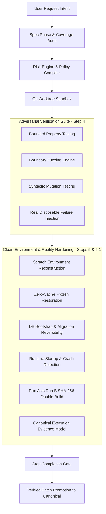

# Antigravity Strict Engineering Kernel (V4.1 + Steps 2-5.1)

A deterministic, risk-adaptive, reality-hardened, and adversarial reliability harness for Google Antigravity on Windows.

## 🛡️ Overview

The **Strict Engineering Kernel** eliminates common AI coding assistant failure modes: premature coding, silent requirement omissions, false-positive test passes, host environment contamination, unverified claims, and reality gaps between reported pass and real project execution.

### Central System Invariant:
```text
NO REAL EXECUTION != PASS
NO REAL DEPENDENCY RESTORE → NO DEPENDENCY PASS
NO REAL BUILD EXECUTION    → NO BUILD PASS
NO REAL TEST EXECUTION     → NO TEST PASS
NO REAL RUNTIME STARTUP    → NO RUNTIME PASS
```

It operates through deep Antigravity lifecycle hooks (`PreInvocation`, `PreToolUse`, `Stop`) to enforce strict engineering invariants across every software development lifecycle step.

---

## 🚀 Architectural Layers



### Core Invariants & Features:
- **Layer 1 (V4 Baseline):** Phase isolation (`SPECIFICATION` vs `IMPLEMENTATION`), 100% semantic requirement coverage, tamper-evident SHA-256 cryptographic evidence hash chain, and baseline regression detection.
- **Layer 2 (V4.1 Adversarial Hardening):** 7 protected critical harness artifacts, multi-replace tool interception, shell command write-vector inspection (`Set-Content`, `Out-File`, cmd `>`, Python `open().write()`, file ops), and single-writer state machines.
- **Layer 3 (Step 2 Git Worktree Sandbox):** Disposable git worktrees (`.git/worktrees/agent-sandbox-*`), isolated patch development, mergeability validation, and rollback safety.
- **Layer 4 (Step 3 Risk Engine & Policy Compiler):** 10-dimension requirement risk scoring (`LOW`, `MEDIUM`, `HIGH`, `CRITICAL`), deterministic verification policy compilation, and dynamic risk escalation on defect discovery.
- **Layer 5 (Step 4 Test Quality & Adversarial Verification):** Bounded property testing, boundary fuzz testing, syntactic mutation testing (operator/boundary/statement mutation), disposable fault injection, and zero surviving mutants on high/critical paths.
- **Layer 6 (Step 5 Clean Environment & Reproducible Build Factory):** Non-blocking container probing, zero-cache scratch source reconstruction (excluding `node_modules`, `venv`, `dist`, `.env`), frozen lockfile enforcement, database migration rollback verification, runtime smoke tests, and double-build bit-for-bit SHA-256 reproducibility verification.
- **Layer 7 (Step 5.1 Reality Gap Hardening & Atomic Packaging):**
  - **Canonical Execution Evidence Model (`ExecutionRecord`):** Captures 9 execution types, 7 origins (`REAL_PROJECT_EXECUTION`, `LIVE_KERNEL_EXECUTION`, `SIMULATED_INTEGRATION`, `KERNEL_UNIT_TEST`, `MOCK`, `MODEL_CLAIM`, `USER_ACCEPTANCE`), scrubbed env/secrets, exit codes, durations, and artifact hashes.
  - **Explicit State Separation:** Clear distinction between `CONFIGURED`, `EXECUTED`, `PASSED`, `NOT_CONFIGURED`, `NOT_APPLICABLE`, and `NOT_EXECUTED`.
  - **Real Subprocess Discovery & Execution:** Subprocess dependency restore (`npm ci` / `pip install -r`), scratch build execution, real test execution, startup crash detection (`STARTUP_CRASH`), smoke journey testing (`JOURNEY_FAILED`), and SQLite migration verification (`MIGRATION_FAILED`).
  - **Non-Destructive Atomic Installer:** Managed block `<!-- STRICT_ENGINEERING_KERNEL_START -->` in `GEMINI.md`, JSON-aware merging in `hooks.json`, safe agent registration, and automated backup/rollback.
  - **Packaged Antigravity Agents:** Includes canonical definitions for `builder`, `spec-architect`, `test-oracle`, `final-verifier`, `diagnostic-engineer`, `scope-auditor`, and `engineering-orchestrator`.

---

## 📂 Project Structure

```text
antigravity-strict-engineering-kernel/
├── agents/                             # Packaged Antigravity Subagent Definitions
│   ├── builder.json
│   ├── diagnostic_engineer.json
│   ├── engineering_orchestrator.json
│   ├── final_verifier.json
│   ├── scope_auditor.json
│   ├── spec_architect.json
│   └── test_oracle.json
├── src/strict_engineering/             # Canonical Kernel Source Modules
│   ├── __init__.py
│   ├── kernel.py                      # State machine & SHA-256 evidence chain (Schema 5.1.0)
│   ├── gate.py                        # Stop gate & PreToolUse security matrix
│   ├── fingerprint.py                 # Deterministic SHA-256 workspace hashing
│   ├── baseline.py                    # Workspace health baseline & regression delta
│   ├── hooks_handler.py               # Antigravity CLI hook dispatcher
│   ├── sandbox.py                     # Git worktree sandbox manager
│   ├── risk_engine.py                 # Multi-factor requirement risk scoring
│   ├── verification_policy.py         # Dynamic policy compiler
│   ├── adversarial_verification.py    # Honest property, fuzz, mutation & fault injection
│   ├── environment_detector.py        # Container, ecosystem & lockfile inspector
│   ├── environment_factory.py         # Clean scratch environment factory & real subprocess executor
│   ├── reproducibility.py             # Double-build SHA-256 artifact comparator
│   ├── installer.py                   # Atomic installer & configuration manager
│   └── reporting.py                   # Multi-schema canonical report generator
├── tests/                             # Comprehensive Test Suites (209 Tests)
│   ├── test_suite.py                  # V4 Baseline (12 tests)
│   ├── test_v41_adversarial.py        # V4.1 Adversarial validation (15 tests)
│   ├── test_step2_sandbox.py          # Step 2 Worktrees & Promotion (19 tests)
│   ├── test_step3_risk_policy.py      # Step 3 Risk & Policy (29 tests)
│   ├── test_step4_adversarial.py      # Step 4 Adversarial Verification (36 tests)
│   ├── test_step5_clean_env.py        # Step 5 Clean Env & Repro (36 tests)
│   ├── test_step51_reality_gap.py      # Step 5.1 Reality Gap Hardening (29 tests)
│   └── test_step6_independent_model.py# Step 6 Verification Contracts (33 tests)
├── scripts/
│   ├── install.py                     # Python-native atomic installer
│   ├── install.ps1                    # PowerShell atomic installer
│   └── run_all_tests.py               # Complete test suite runner
├── GEMINI.md                          # Antigravity strict engineering system prompt
├── hooks.json                         # Antigravity lifecycle hooks configuration
├── pyproject.toml                     # Modern Python project configuration
├── run_tests.py                       # Top-level test runner
└── README.md
```

---

## ⚡ Installation

### Option 1: Python-Native Atomic Installer (Cross-Platform)

```bash
python scripts/install.py
```

### Option 2: PowerShell Atomic Installer (Windows)

```powershell
powershell -ExecutionPolicy Bypass -File .\scripts\install.ps1
```

This will:
1. Safely copy the strict engineering modules into `~/.gemini/config/strict-engineering/`.
2. Atomically merge hooks into `~/.gemini/config/hooks.json` without overwriting other tools.
3. Inject managed blocks into `~/.gemini/GEMINI.md` while preserving custom prompt instructions.
4. Install the 7 specialized agent definitions into `~/.gemini/config/agents/`.
5. Execute the test suite to ensure 100% verification pass rate.

---

## 🧪 Running Tests

To run all 209 tests across the 8 test suites:

```bash
python run_tests.py
```

Or using unittest discover:

```bash
python -m unittest discover -s tests -p "test_*.py" -v
```

---

## 📊 Verification Metrics

- **Total Test Cases:** 209
- **Pass Rate:** 100% (209 / 209 PASS)
- **Total Test Execution Time:** ~71 seconds
- **Zero External Dependencies:** Built entirely with Python standard library for maximum portability and zero supply-chain risk.

---

## 📄 License

MIT License. See [LICENSE](LICENSE) for details.
